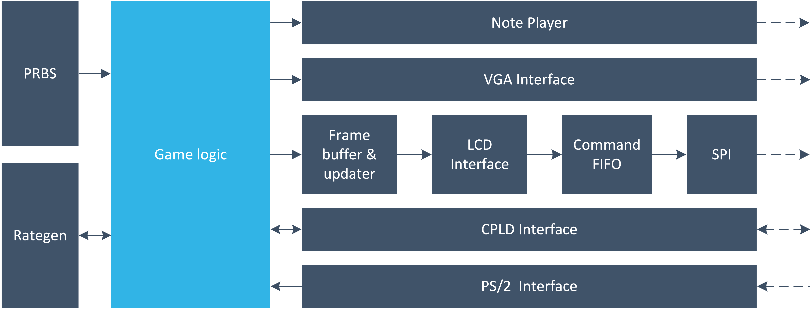

# Tetris game on a Field Programmable Gate Array (FPGA)
This repository holds an FPGA-based Tetris game implementation in **Verilog** that does not rely on any soft- or hard-core processor. The synthesized hardware supports two display modalities (VGA, SPI LCD), two control options (onboard buttons, PS/2 keyboard), and game melody synthesis through direct digital synthesis (DDS).

Should you find this repository helpful for your studies or your work, please give it a star.  
If you have any questions, queries, or recommendations, simply open an issue.

## System overview

The implementation of the game is divided into independent functional hardware blocks:
- **SPI** (Serial Peripheral Interface): low-level peripheral, responsible for the communication with the LCD.
- **Command FIFO**: buffers the commands to be sent over *SPI* to the LCD.
- **LCD interface**: it fills the *Command FIFO* with initialization commands and pixels to be displayed.
- **Frame buffer and updater**: it maps the current game space to the LCD's pixel space.
- **VGA interface**: it maps the current game space and state to a PC monitor.
- **Note player**: it supplies the melody of the Tetris game via a piezoelectric buzzer. The melody speeds up as the game difficulty is increased.
- **PRBS generator** (Pseudo Random Binary Sequence): this module generates pseudo-random numbers that are directly used for selecting the next falling building block.
- **Rate generator**: it manages the speed of the falling blocks and the rate of the game melody.
- **CPLD interface**: some onboard buttons and a 7-segment display are connected to another programmable device, a CPLD (Complex Programmable Logic Device), and the CPLD is interfaced with the FPGA. This module maps the points acquired by the user to the 7-segment display and samples the onboard button presses.
- **PS/2 interface**: it interprets the PS/2 keyboard scancodes for enabling a regular keyboard gameplay.
- **Top-level module**: it instantiates the modules listed above and implements the game logic itself.

More details are available in the shared [documentation](documentation.pdf).

## References
[1] [Tetris on Wikipedia](https://en.wikipedia.org/wiki/Tetris)  
[2] [Logsys development environment](http://logsys.mit.bme.hu/en)